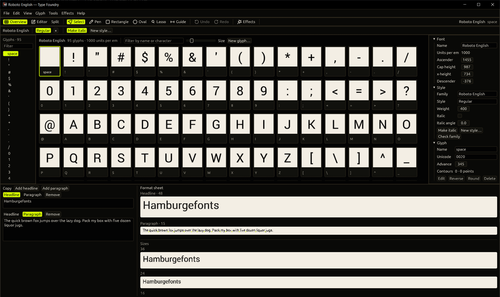
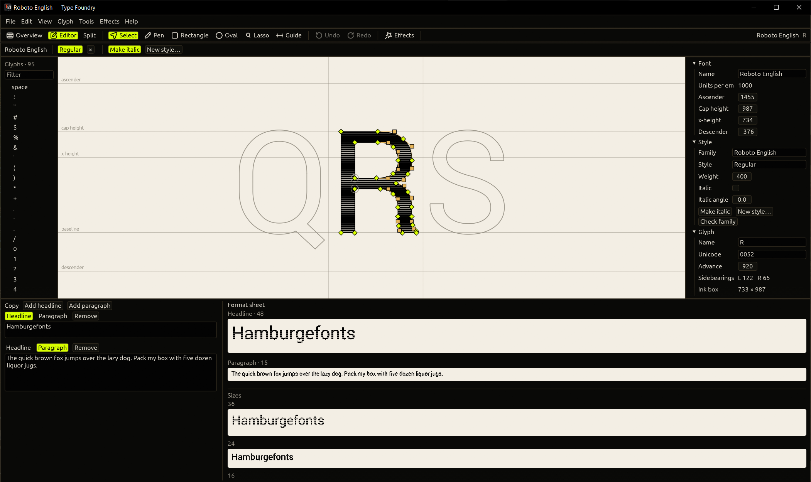
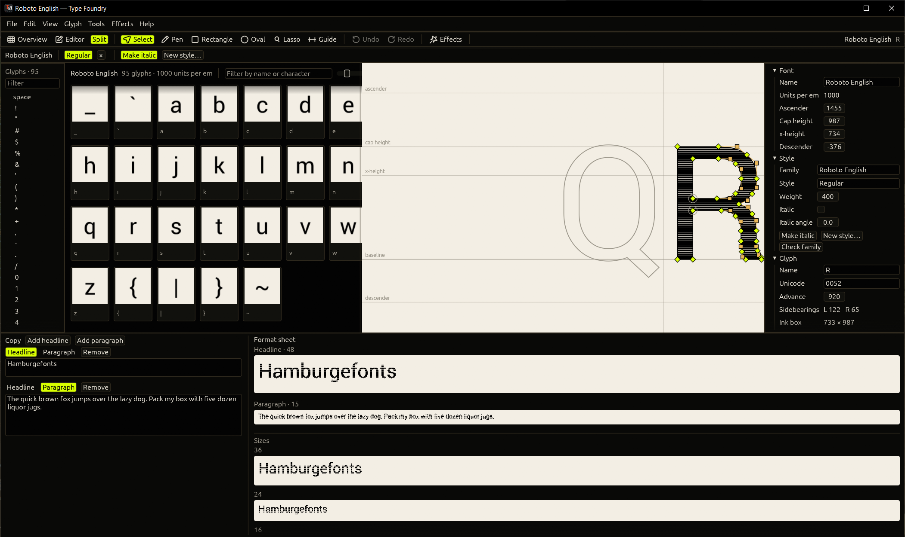

# Type Foundry

I wanted a type-design program of my own. I can make fonts in it now, and I wanted other designers to have it too. I am open to developing it with anyone who wants to work on it.

A local type-design kit. The same command API drives the font model, plugins, and AI. The first working piece is blending two compatible fonts into a new one.

This is not a fork of [Shift](https://github.com/shift-editor/shift). Shift is the reference for a modern editor: a Rust font core, with import and export around it. Scripting and an AI API are still on Shift's future list. Those are the parts this project builds first.

## How to use

`typefoundry` is the drawing window. A path on the command line opens on launch.

```text
typefoundry Fonts/Roboto-English.json
```

File > Open reads a Type Foundry JSON file, a UFO folder, TrueType, OpenType, WOFF 1, the first face of a collection, Three.js typeface JSON, or webfontjson. File > Open SVG folder reads a folder of filled SVG glyphs named `0041.svg`. File > Open recent lists the last ten fonts opened or saved. WOFF2 opens like WOFF 1. Embedded OpenType is refused. On Windows the first launch adds Type Foundry to the Start menu.

The pictures below are `Fonts/Roboto-English.json`.

### Look at the font

The window opens on the overview: every glyph at one scale. Filter by name or character. Double-click a cell, or press Enter, to edit it. `[` and `]` step to the previous and next glyph. The list on the left does the same.



### Edit a glyph

The editor draws the filled outline, the metric lines, and a handle on every point. Scroll zooms around the pointer. The right or middle mouse button pans. Ctrl+0 fits the glyph again.

Select (V) clicks a point, Shift-clicks to add to the selection, and drags empty space to box-select. Drag the selection to move it. The arrow keys nudge one unit, and Shift-arrows nudge ten. Alt-click an outline to add a point on that segment without changing the shape. Delete removes the selected points.

Lasso (L) drags a loop around the points you want. Pen (P) clicks to add corners, Shift-clicks for an off-curve point, and clicks the first point to close the contour. Rectangle (R) and Oval (O) drag out one closed shape. Escape cancels that drag. Guide (G) drags across the canvas for a horizontal guide, or up and down for a vertical one. Guides are yours: they show on every glyph of the family, they are not written into the font, and they stay between launches. View > Background switches the editor between white and black. On black, the letter is drawn white.

Ctrl+Z undoes. Every change is one command, so one undo puts the glyph back. The same commands are what the CLI and the MCP server run.

View > Onion skin draws the previous glyph and the next one beside the glyph you are editing, as outlines with no handles.



Split on the toolbar, or View > Overview and editor, keeps the grid beside the glyph. Drag the bar between them. Overview, Editor, Ctrl+1, and Ctrl+2 return to one pane.



The inspector on the right edits the font name, the metrics, the style, and the current glyph. With one point selected it edits that point. With several it aligns them.

### Read it in words

The review sheet sets your own headlines and paragraphs in the open font. Headlines are drawn at 48 pixels and paragraphs at 15, then the first headline again at 36, 24, 16, and 11. Type into the copy column, switch a block between headline and paragraph, or add one. View > Review sheet hides the panel. Bottom, Right, and Window place it. The words stay between launches. Click a letter in the sheet to select that glyph.

### Save, and more than one style

Ctrl+S writes the file you opened. Save As (Ctrl+Shift+S) writes JSON, a UFO, or TrueType. A `.ttf` from this window is the file Windows can install.

Make italic (Ctrl+Shift+I, or the button on the tab row) copies the open font, leans it, and leaves the original open and unchanged. New style from this font (Ctrl+Shift+D) is the same idea for another name, such as Bold. The tabs along the top are the open fonts. Export family writes one file per style into a folder. Check family lists what does not match.

Help > Keyboard shortcuts, or F1, lists the keys.

## Today

```text
foundry new --name "Wide" --upm 1000 --out wide.json
foundry check narrow.json wide.json
foundry blend narrow.json wide.json --t 0.5 --out mid.json
foundry blend Narrow.ufo Wide.ufo --t 0.5 --out Mid.ufo
foundry run --file commands.jsonl
foundry mcp
```

A `save` command whose path ends in `.ttf` writes an installable TrueType file from the open font. `open`, `check`, and `blend` also read `.ttf`, `.otf`, `.woff` (WOFF 1), and the first face of a `.ttc` or `.otc`. See `documents/font-formats.md`.

```json
{"op":"save","path":"Mid.ttf"}
```

`foundry run` reads one JSON command per line. That stream is the plugin and AI surface. See `documents/api.md`.

`typefoundry` is the drawing window described above. Every edit is a session command. See `Design/README.md` for the chrome and the canvas.

`Fonts/Roboto-English.json` and `Fonts/Roboto-Cyrillic.json` are Roboto Regular cut to English (U+0020–U+007E) and Cyrillic (U+0400–U+04FF). The license is in `Fonts/NOTICE.md`.

`foundry-mcp`, or `foundry mcp`, is a stdio MCP server, so a chat client can open, inspect, move points, check, blend, and save. It works only on local files and uploads nothing.

Blend is linear interpolation. Both fonts need the same glyph names, contour counts, point counts, and point types. That is the same rule variable-font masters use. Two unrelated typefaces will be refused until a later matching step exists. `open`, `save`, `check`, and `blend` accept a `.ufo` directory as well as the JSON working file. `open` also reads typeface JSON and web fonts (`.ttf`, `.otf`, `.woff`, webfontjson, and WOFF2). `save` also writes `.ttf`.

## Layout

- `App/` — Rust workspace. `foundry-core` holds the font, `foundry-api` runs commands, `foundry-cli` is the `foundry` binary, `foundry-app` is the `typefoundry` window, `foundry-mcp` is the MCP server.
- `Agent/CONTEXT.md` — project facts and the session log.
- `documents/api.md` — the command contract.
- `Design/` — the window and its chrome.

Build output goes to `C:\Users\Troy Havelin\AppData\Local\typefoundry-target` because this share creates files without execute permission.

From `App/`:

```text
cargo run -p foundry-cli -- check a.json b.json
cargo run -p foundry-app --release
cargo build --release -p foundry-mcp
powershell -ExecutionPolicy Bypass -File scripts/check.ps1
```

Remote: `git@github.com:thavelin/Type-Foundry.git`

Hub: https://app.notion.com/p/3ef627d6cfdc81e4a936e4f714b7aff0
